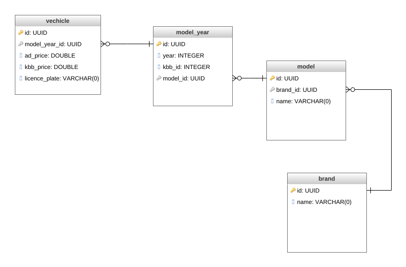

# DRYVE
## Rest api de cadastros de veículos 

# Tecnologias 
## java spring boot 
## versionamento de dados : flyway
## integração : feign client

### relacionamento entre entidades

  

### para executar você precisa 
criar um bando de dados postgres chamado : "drive" rodando em localhost:5432

## aconcelho que configure a profile do projeto para sua execução em para produção para que ele execute o application-prd setando a spring_profiles_ative para prd

